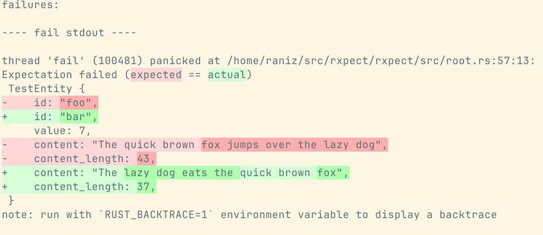

# RXpect

A Rust library for fluently building expectations in tests.

## What is fluent assertions?

Test assertions that are readable, with output that is understandable.



If we're only asserting on equality, `assert_eq!` goes a long way,
but when assertions become more complex, it breaks down.

Consider that you want to make sure that an item is in a vector.
With standard asserts you'd have to write `assert!(haystack.contains(&needle))`. 
If that fails, the error is not the most helpful, it'll only tell you that the assertion failed and repeat the code in the assert macro - it gives you no information about the contents of the haystack, nor what the needle is.

With rxpect, you'll not only get a more readable assertion, the error message is more helpful too.

```rust,no_run
use rxpect::expect;
use rxpect::expectations::iterables::IterableItemEqualityExpectations;
let haystack = vec![1, 2, 3, 4, 5, 6];
let needle = 7;

// Expect to find the needle in the haystack
expect(haystack).to_contain_equal_to(needle);
```

```shell
thread 'main' (311272) panicked at /home/raniz/src/rxpect/src/root.rs:54:13:
Expectation failed (a ⊇ b)
a: `[1, 2, 3, 4, 5, 6]`
b: `[7]`
```

## Another library for fluent assertions?

None of the other libraries worked quite like I wanted them to.
I also wanted to test my ideas about how a fluent assertion library in Rust could work.

## What about the name?

All other names I could come up with were already taken.

### What does it mean?

Either _Rust Expect_ or _Raniz' Expect_, pick whichever you like best.

## How do I use this thing?

It's pretty simple actually,
wrap whatever you're having expectations on with `expect` and then call the different
extension methods.

```rust
use rxpect::expect;
use rxpect::expectations::EqualityExpectations;

// Expect 1 plus 1 to equal 2
expect(1 + 1).to_equal(2);
```

```shell
running 1 test
test tests::that_one_plus_one_equals_two ... ok

test result: ok. 1 passed; 0 failed; 0 ignored; 0 measured; 0 filtered out; finished in 0.00s
```

You can even chain multiple assertions on the same value indefinitely, and all errors will be reported:

```rust,no_run
use rxpect::expect;
use rxpect::expectations::{EqualityExpectations, OrderExpectations};

expect(0)
    .to_equal(2)
    .to_be_greater_than(1);
```

```shell
thread 'main' (57062) panicked at /home/raniz/src/rxpect/rxpect/src/root.rs:53:17:
Expectation failed (expected == actual)
expected: `2`
  actual: `0`
Expectation failed (a > b)
a: `0`
b: `1`
```

For complex types, there exists the concept of projections,
which will add expectations on a projected value:

```rust
use rxpect::expect;
use rxpect::ExpectProjection;
use rxpect::expectations::EqualityExpectations;

#[derive(Debug)]
struct MyStruct {
    foo: i32,
}

let value = MyStruct { foo: 7 };

expect(value)
    .projected_by(|s| s.foo)
    .to_equal(7);
```

If you have multiple fields, you can "unproject" and continue with the parent value,
possibly projecting in a different way:

```rust
use rxpect::expect;
use rxpect::ExpectProjection;
use rxpect::expectations::EqualityExpectations;

#[derive(Debug)]
struct MyStruct {
    foo: i32,
    bar: &'static str,
}

let value = MyStruct { foo: 7, bar: "rxpect" };

expect(value)
    .projected_by(|s| s.foo)
        .to_equal(7)
        .unproject()
    .projected_by(|s| s.bar)
        .to_equal("rxpect");
```

You can even nest projections if necessary:


```rust
use rxpect::expect;
use rxpect::ExpectProjection;
use rxpect::expectations::EqualityExpectations;

#[derive(Debug)]
struct Parent {
    child: Child,
}

#[derive(Debug)]
struct Child {
    foo: i32,
}

let value = Parent { child: Child { foo: 7 } };
expect(value)
    .projected_by_ref(|p| &p.child)
        .projected_by(|s| s.foo)
            .to_equal(7);
```
## Finding expectations
All expectations are implemented as extension traits on the `ExpectationBuilder` trait.
This is to ensure extensibility and modularity.
This can make discovering expectations a bit tricky.
The easiest way to find them is to look at the various traits in the [`expectations`] module.

## Custom expectations
RXpect is built with extensibility in mind.
In fact, all bundled expectations are implemented in the same way as custom expectations should be - as extension traits.

To add a custom expectation, add a new extension trait and implement it for the `ExtensionBuilder`,
adding any restrictions on trait implementations of the type under test that you need.

```rust
use rxpect::expect;
use rxpect::ExpectationBuilder;
use rxpect::Expectation;
use rxpect::CheckResult;
use rxpect::expectations::PredicateExpectation;

// This is the extension trat that defines the extension methods
pub trait ToBeEvenExpectations {
    fn to_be_even(self) -> Self;
    fn to_be_odd(self) -> Self;
}

// implementation of the extension trait for ExpectationBuilder<'e, Value = u32>
impl<'e, B: ExpectationBuilder<'e, Value = u32>> ToBeEvenExpectations for B
{
    fn to_be_even(self) -> B {
        // Expectation implementation with a custom expectation implementation
        // Better if you need complex logic or more context,
        // also gives full control over the error handling
        self.to_pass(EvenExpectation)
    }
    
    fn to_be_odd(self) -> B {
        // Expectation implementation with a predicate
        // suitable for simpler checks
        self.to_pass(PredicateExpectation::new(
            // The expected/reference value, passed to both the predicate
            // and the error message producer. We don't use one here
            (),
            // The check, returns a bool
            |actual, _reference| actual % 2 != 0,
            // This is called to get the error message in case the check fails
            |actual, _reference| format!("Expected odd value, but got {actual}")
        ))
    }
}

// Custom expectation to implement the check
struct EvenExpectation;

impl Expectation<u32> for EvenExpectation {
    fn check(&self, value: &u32) -> CheckResult {
        if value % 2 == 0 {
            CheckResult::Pass
        } else {
            CheckResult::Fail(format!("Expected even value, but was {value}"))
        }
    }
}

expect(2).to_be_even();
expect(3).to_be_odd();
```


## I don't like it

Use something else.
Here's a bunch of other crates that also does fluent expectations,
in no particular order:

- <https://crates.io/crates/totems>
- <https://crates.io/crates/lets_expect>
- <https://crates.io/crates/fluent-assertions>
- <https://crates.io/crates/xpct>
- <https://crates.io/crates/expect>
- <https://crates.io/crates/fluent-asserter>
- <https://crates.io/crates/spectral>
- <https://crates.io/crates/assertables>
- <https://crates.io/crates/speculoos>
- <https://crates.io/crates/assert>
- <https://crates.io/crates/rassert>
